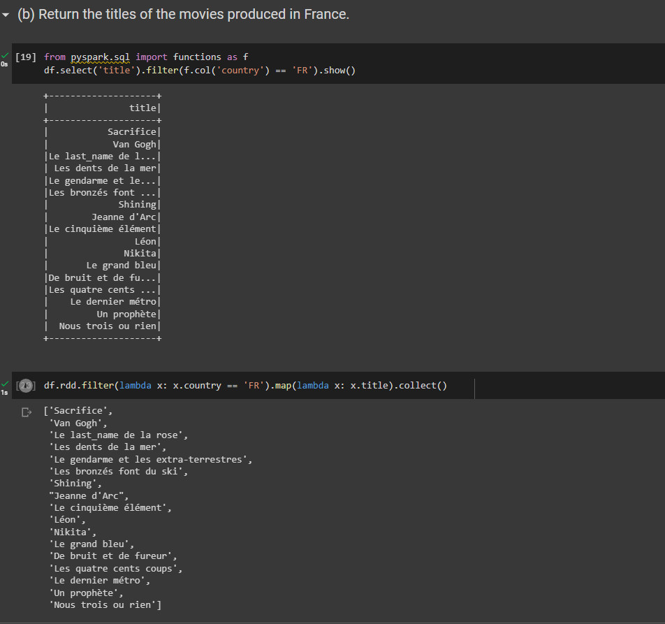
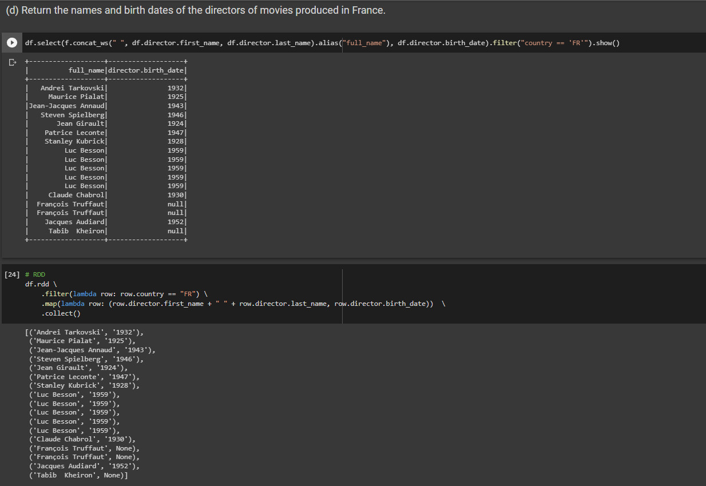
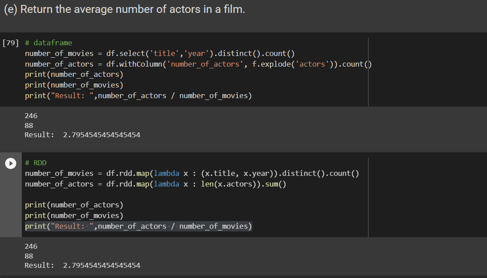
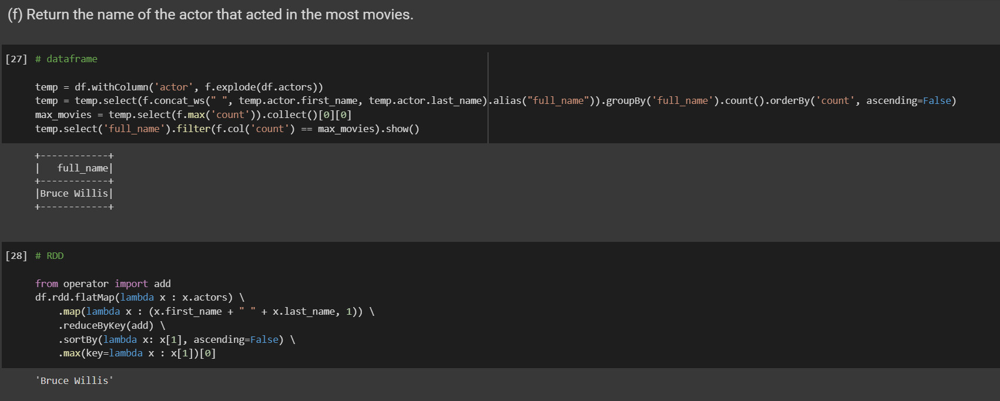
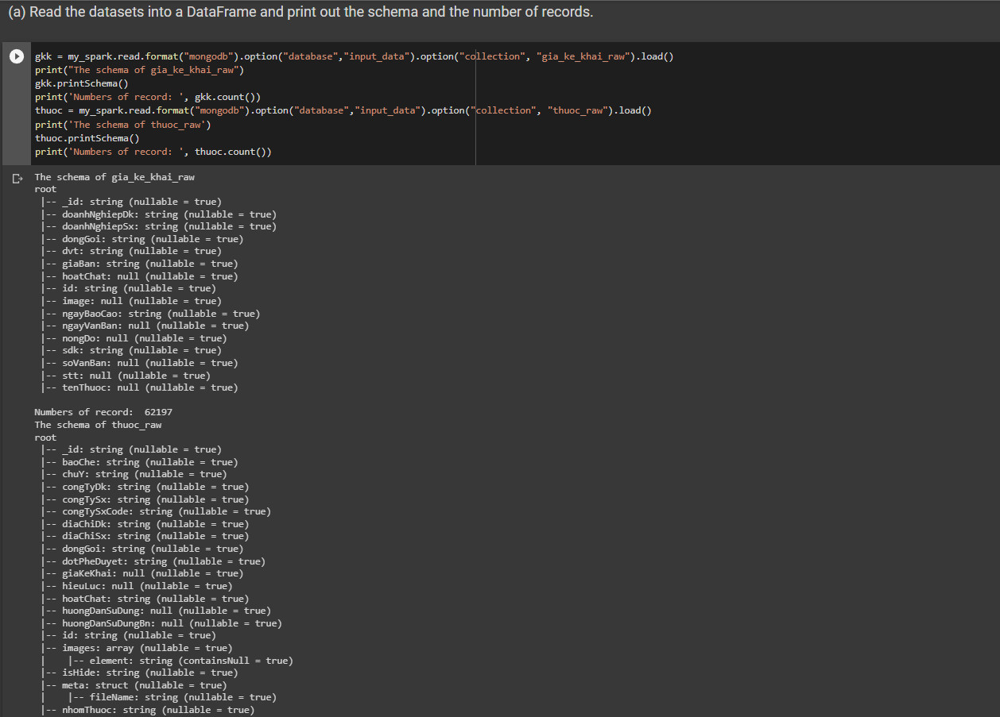

# Lab 03: Apache Spark with MongoDB
# Part 1: Introduction to PySpark

### (b) Return the titles of the movies produced in France.

#### Explain code: 
- DataFrame
    + I select 'title' with condition 'country' == 'FR' by the filter funtion and use the show function to display the result
- RDD
    + I use the filter function to filter through each line with the condition 'country' == 'FE', then I use the map function to run through each line to get the title.

### (d) Return the names and birth dates of the directors of movies produced in France.

#### Explain code: 
- DataFrame
    + I use concat_ws to merge 2 column with space with alias 'full_name',then i use sellect function to choose 'full_name' and birth_date of director with condition 'country' == 'FR' by filter function. 
- RDD
    + I use the filter function to filter through each line with the condition 'country' == 'FE', then I use the map function to run through each line to get the first_name, last_name, birth_date based on the filter function's condition.

### (e) Return the average number of actors in a film.

#### Explain code: 
- DataFrame
    + I count distinct value of 'title' and 'year' and assign to number_of_movie 
    + I create a new column 'number_of_actors' and count the number of actors by count function and assign to number_of_actors
    + Resulte, i will get number_of_actors devided number_of_movie
- RDD
    + I use map funtion through each line for count distinct title and year, assign to number_of_movie
    + I use map function through each line for sum all actors and assign to number_of_actors.
    + Resulte, i will get number_of_actors devided number_of_movie

### (f) Return the name of the actor that acted in the most movies.

#### Explain code: 
- DataFrame
    + First, i use concat_ws to merge 2 column with space with alias 'full_name', then i group by 'full_name', count and sort by descending and assign to temp
    + Second, i find max count attribute of dataframe's temp and assign to max_movie
    + Result, i select 'full_name' with condition f.col'count' == max_movie by filter funtion.
- RDD
    + I use flatMap function to split the words of actors column, then I use map function with key is first_name + " " + last_name , the value I assign is 1. Next, I will calculate the number of times that key appears through reduceByKey function, I will sort the value descending, finally find the max and print the first value

# Part 2: Real-world Data Manipulation
### (a)  Read the datasets into a DataFrame and print out the schema and the number of records.

#### Explain code: 
- I read data from mongoDB by read.format('mongodb') with oftion database and input_data, another option collection and gia_ke_khai_raw. Load funtion for taking data and i assign to gkk.
- Count the number of records , i use the count funtion 
- Similarly for thuoc_raw data

## Self-reflection

### 20127435 - Tran Van An

+ After completing above tasks, 

### 20127395 - Phan Minh Xuan

+ After completing above tasks, I understand how to use the dataframe and RDD in Apache Spark, they query similarly to SQL, so t can prepare for final exam.

### 20127032 - Bui Gia Huy

+ After completing above tasks, 

### 20127631 - Thai Van Thien

+ After completing the above tasks, 

## Member's contribution

Task | Result
----------------------------------------|----------
1a. Count the number of movies by country. Sort by count in decreasing order.                     | 100%
1b. Return the titles of the movies produced in France.            | 100%
1c. Return the title of the movies of which Sofia Coppola is one of the actresses.                          | 100%
1d. Return the names and birth dates of the directors of movies produced in France.                         | 100%
1e. Return the average number of actors in a film.                    | 100%
1f. Return the name of the actor that acted in the most movies.                        | 100%
2a. Read the datasets into a DataFrame and print out the schema and the number of records.                     | 100%
2b. Show all records in the `thuoc_raw` collection that have the same active pharmaceutical ingredient (API) in their `hoatChat` field as their medicine name.                  | 100%
2c. Create a new DataFrame from the `thuoc_raw` collection that splits the API in the `hoatChat` field into multiple rows. For example, "paracetamol" is the API in "Paracetamol 500 mg," and "amoxicillin" is the API in various medications such as "Amogentine 500mg/125mg," "Augbactam 1g/200mg," and "Viamomentin." The resulting DataFrame should have two columns: `hoatChat` and `thuocTuongUng` as a list. After processing the data, write it back to our MongoDB at `output_data.thuocthaythe`.      | 100%
2d. Create new DataFrame from two mentioned above that contains  `tenThuoc`, `hoatChat`, `dongGoi`, `dvt` and `giaBan`. After process the data, write it back to our mongodb at `output_data.giathuoc`.           | 100%

MSSV | Member | Contribution Percentage
-----|------------------|---------------
20127435 | Tran Van An       | 25%
20127395 | Phan Minh Xuan    | 25%
20127032 | Bui Gia Huy       | 25%
20127631 | Thai Van Thien    | 25%

## References

+ Lab requirement pdf

